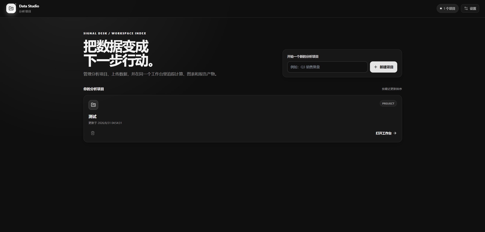
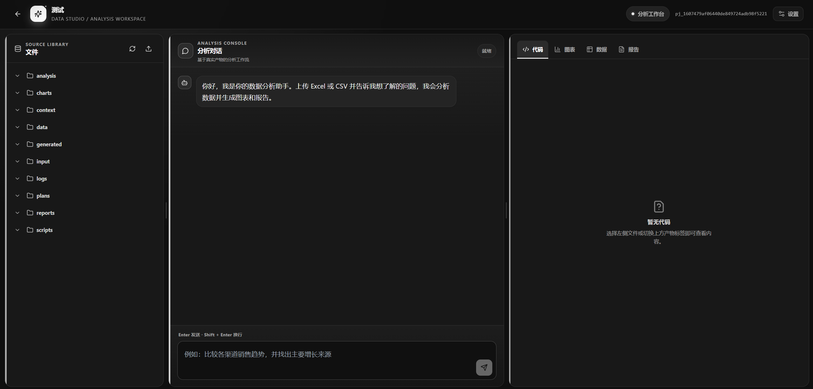

# AI 数据分析应用

AI 数据分析应用是一款面向业务人员、运营人员和数据分析师的智能分析工作台，适合在需要快速理解 CSV/Excel、定位业务变化、验证指标口径或生成分析报告时使用。上传数据并用自然语言描述问题，系统会规划分析步骤、编写并隔离执行 Python 脚本，再把指标、发现、图表和建议整理成可追溯的 HTML 报告。

应用以独立 Project Workspace 管理每次分析，报告中的指标、结论、证据和图表通过显式契约关联，并在发布前经过服务端校验，尽量减少口径错配、无证据结论和误导性图表。

> 在线预览：[Vercel 部署](https://ai-data-analysis-app-seven.vercel.app/)。该地址用于界面和基础 API 演示；Vercel 多实例不会持久保存当前 SQLite 与 Workspace 数据，且不提供本项目所需的 Docker 二级分析沙箱，因此请勿上传真实数据。完整 AI 分析链路请按下方步骤在本地运行。

## 可以用它做什么

| 使用场景 | 能力 |
| --- | --- |
| 拿到一份陌生的 CSV 或 Excel | 自动识别字段、样本、缺失值和数据分布 |
| 需要复盘销售、运营或库存表现 | 用自然语言提出问题，生成分析计划、指标和图表 |
| 想定位异常波动或主要贡献来源 | 执行 Python 分析并保存可复查的代码、数据与发现 |
| 需要向团队汇报分析结果 | 生成带口径、证据、图表和建议的离线 HTML 报告 |

## 主要功能

- 按项目隔离原始文件、对话、分析计划、脚本、产物和报告。
- 支持 CSV、XLSX 和 XLS 文件上传与自动数据画像。
- 通过结构化 Agent Action 规划任务、执行分析并沉淀 Findings。
- 在禁网、限时、限 CPU/内存/PID 的 Docker 沙箱中运行模型生成的 Python。
- 实时展示分析进度，支持停止、继续、重试和重新生成报告。
- 在同一工作台中查看代码、图表、数据文件和最终报告。
- 通过 Metric、Claim、Evidence、Semantic 和 Editorial 校验发布报告。
- 支持 OpenAI-compatible 模型配置、预设选择和连接测试。

## 界面预览

<table>
  <tr>
    <td width="50%" align="center">
      <strong>分析项目</strong><br>
      
    </td>
    <td width="50%" align="center">
      <strong>分析工作台</strong><br>
      
    </td>
  </tr>
</table>

## 快速开始

本地运行需要 Python 3.12、Node.js 22+、Docker Desktop / Docker Engine，以及一个 OpenAI-compatible 模型服务。

### 1. 安装依赖并配置模型

```powershell
python -m venv .venv
.\.venv\Scripts\python.exe -m pip install -e ".\backend[dev]"

Set-Location frontend
npm ci
Set-Location ..

Copy-Item .env.example .env
```

打开 `.env`，填写模型配置：

```dotenv
LLM_API_BASE=https://your-openai-compatible-endpoint/v1
LLM_API_KEY=your-api-key
LLM_MODEL=your-model-name
```

### 2. 构建分析沙箱

```powershell
docker build -f docker/Dockerfile.analysis -t ai-analysis-sandbox:latest docker
```

### 3. 启动项目

在两个终端中分别运行：

```powershell
Set-Location backend
..\.venv\Scripts\python.exe -m uvicorn main:app --host 127.0.0.1 --port 8000
```

```powershell
Set-Location frontend
npm run dev
```

启动成功后访问 `http://127.0.0.1:3000`，后端健康检查位于 `http://127.0.0.1:8000/api/health`。

## 技术栈

- Next.js 15 + React 19 + TypeScript + Tailwind CSS
- FastAPI + Pydantic + SQLAlchemy + Uvicorn
- pandas + NumPy + openpyxl + xlrd
- OpenAI-compatible Chat Completions
- Docker 隔离执行环境
- SQLite + Project Workspace 文件系统
- pytest + Vitest + Testing Library + Playwright

## API Key 与数据安全

- 模型 API Key 只由 FastAPI 后端读取，不会写入浏览器代码。
- `.env`、数据库、Workspace、日志和生成报告默认被 Git 忽略。
- 模型生成的 Python 不在 FastAPI 主进程执行，而是在受限 Docker 沙箱中运行。
- 沙箱不挂载 `.env`、Docker socket 或其他项目，并默认禁止外网访问。
- 上传样本、模型重试上下文和进程输出均设置长度上限。
- 如果 Key 曾被提交到 Git，请立即撤销并重新生成。

## 测试与构建

后端：

```powershell
Set-Location backend
..\.venv\Scripts\python.exe -m pytest -q --ignore=tests/test_sandbox_integration.py --ignore=tests/test_report_browser_rendering.py
```

前端：

```powershell
Set-Location frontend
npm test
npm run typecheck
npm run lint
npm run build
```

Docker 隔离测试需要可用的 Docker daemon，浏览器报告测试需要本机 Chromium。自动化测试默认使用 Mock Provider，不消耗模型额度。

## 常见故障排查

| 问题 | 处理方式 |
| --- | --- |
| 页面可以打开，但提示无法连接后端 | 确认 FastAPI 已在 `127.0.0.1:8000` 运行，并访问 `/api/health` 检查状态；同时确认 `NEXT_PUBLIC_API_BASE_URL` 指向浏览器可访问的地址。 |
| 无法开始分析或模型连接测试失败 | 确认 `LLM_API_BASE`、`LLM_API_KEY` 和 `LLM_MODEL` 已填写，模型端点兼容 `/chat/completions`，并且后端主机可以访问该服务。 |
| 模型在生成 JSON 前耗尽输出预算 | 对默认启用深度推理的模型设置 `LLM_THINKING_ENABLED=false`，必要时调整 `LLM_MAX_TOKENS`。 |
| 提示 `Docker runtime is unavailable` | 启动 Docker Desktop / Docker Engine，确认 `docker version` 可执行，并重新构建 `ai-analysis-sandbox:latest`。 |
| Windows 下分析进程不稳定 | 使用单进程 Uvicorn 启动后端，不要添加 `--reload`。 |
| 文件上传失败 | 确认文件为 CSV、XLSX 或 XLS，大小未超过 `MAX_UPLOAD_BYTES`，并检查 `WORKSPACE_ROOT` 的写入权限和磁盘空间。 |
| 报告为空、图表缺失或生成失败 | 查看分析进度和 Workspace 的 `logs/`；重点检查指标口径、Claim/Evidence 关联和图表字段引用，然后重试生成。 |
| 重新生成报告后仍显示旧内容 | 对页面执行硬刷新；前端会根据文件 revision 重新加载报告预览。 |
| SQLite 提示锁定 | 避免多个后端实例同时操作同一个 SQLite 文件；云部署时应改用适合多实例的持久化方案。 |
